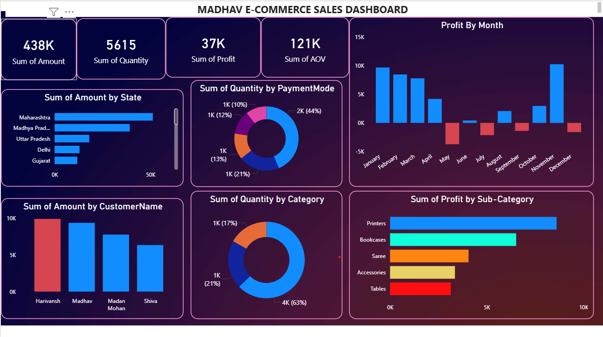

# 📊 Madhav E-Commerce Sales Dashboard (Power BI)

## 📌 Project Overview
This project presents an interactive **E-Commerce Sales Dashboard** built using Power BI.  
The dashboard helps analyze overall business performance by visualizing key metrics such as sales, profit, quantity, and customer trends.

---

## 🎯 Objectives
- To analyze sales performance across different states
- To track monthly profit trends and identify loss periods
- To understand customer purchasing behavior
- To evaluate category and sub-category performance
- To analyze preferred payment modes

---

## 📊 Key Insights
- Total Sales Amount: **438K**
- Total Quantity Sold: **5615**
- Total Profit: **37K**
- Average Order Value (AOV): **121K**

- Maharashtra and Madhya Pradesh contribute highest sales
- Some months show negative profit indicating loss
- Printers and Bookcases generate highest profit
- Majority transactions happen via specific payment modes

---

## 📈 Dashboard Features
- State-wise Sales Analysis  
- Profit by Month (Trend Analysis)  
- Customer-wise Revenue Contribution  
- Category & Sub-Category Insights  
- Payment Mode Distribution  

---

## 🛠 Tools & Technologies Used
- Power BI  
- Data Cleaning & Transformation  
- Data Visualization Techniques  

---

## 📸 Dashboard Preview

---

## 📂 Files Included
- `Madhav_Ecommerce_Dashboard.pbix` – Power BI file  
- `Orders.csv` – Dataset  
- `Details.csv` – Dataset  
- `dashboard.png` – Dashboard screenshot  

---

## 💡 Conclusion
This dashboard provides valuable insights into sales and profit patterns, helping businesses make data-driven decisions and improve performance.

---

## 🔗 Connect with Me
(Add your LinkedIn profile link here)
